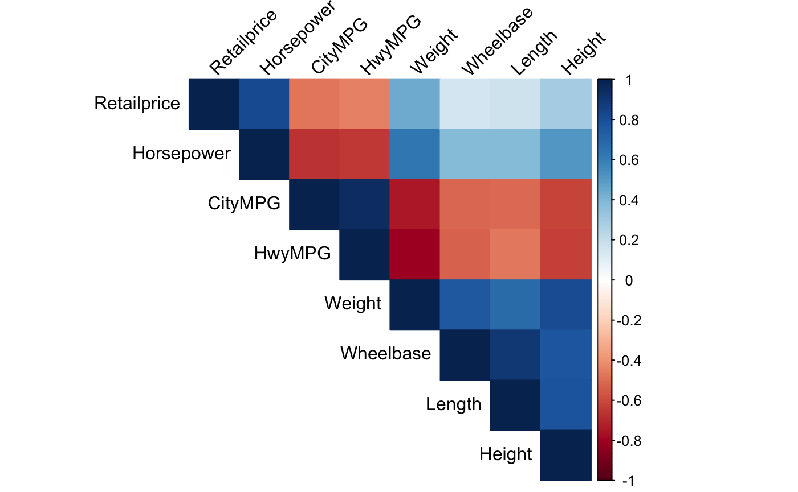
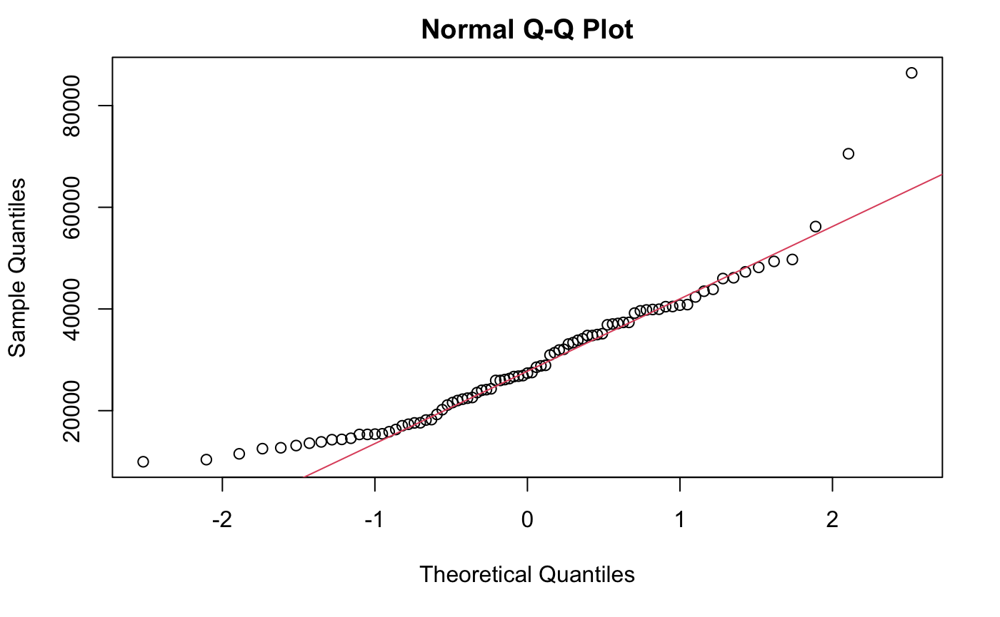

# car-retail-price-prediction

# Predictive Insights into Car Retail Pricing Using Elastic Net and Robust Regression

## Introduction
In the automotive industry, understanding the dynamics of retail prices is essential for manufacturers, dealers, and consumers. This project utilizes predictive modeling to uncover patterns and relationships that drive vehicle pricing. Using data cleaning, feature engineering, and model selection techniques, I have built a model that predicts car retail prices based on various attributes.

## Data Cleaning
Several data cleaning steps were performed to ensure data quality and reliability:
- **Missing Data Imputation**: The `mice` package was used to fill in missing values through multiple imputation, preserving the dataset’s integrity.
- **Data Type Standardization**: All categorical and quantitative variables were converted to `factor` and `numeric` data types, respectively.
- **Normalization**: Quantitative variables were normalized using the `scale()` function to ensure uniformity and reliable data.

## Model Selection
Two models were selected for this project:
1. **Elastic Net**: Combines Ridge and Lasso regression to handle multicollinearity and predictor selection.
2. **Robust Regression**: Effectively handles outliers, preventing skewed results due to extreme values.

Both models were evaluated using 10-fold cross-validation. The best model was determined through a 5-fold outer layer double cross-validation process.

## Results and Interpretation
The best performing model was **Elastic Net**, which yielded the lowest Root Mean Squared Error (RMSE) of 8,539. The top predictors identified were:
- **Cylinders**: Positive relationship with retail price.
- **Horsepower**: Positive relationship with retail price.

These results suggest that more powerful cars tend to be more expensive, aligning with industry expectations.

## Visualizations
Here are some of the key visualizations from the project:

### Correlation Matrix

### Predicted vs Actual Retail Prices

### QQ Plot

## Conclusion
My analysis explored the relationships involved in predicting car retail prices. Despite strong predictive power, the model could be improved by incorporating additional variables like car make and model. Future research could focus on making these enhancements to better capture the factors influencing high retail prices.
